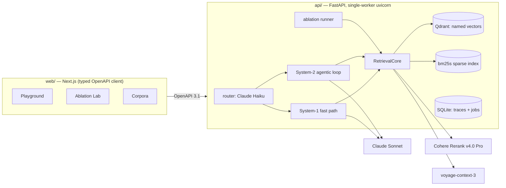
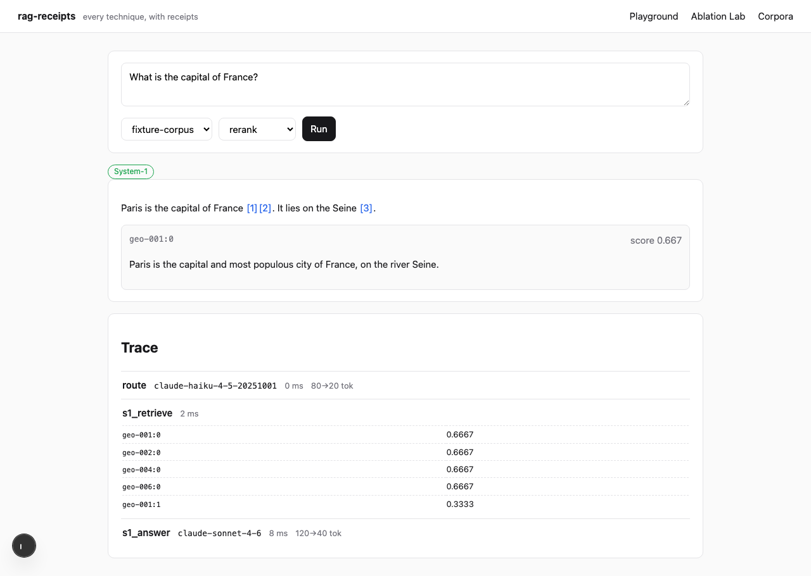
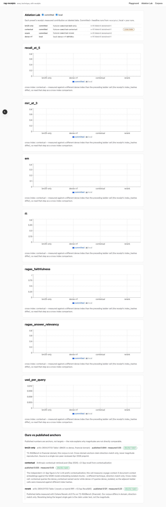

# rag-receipts

**Every RAG technique, with receipts.** An adaptive RAG engine that routes each query
between a fast path and a deliberative agentic loop — with a built-in Ablation Lab that
measures each component's contribution on labeled data, compared honestly against
published anchors.

## Why this is different

Thousands of RAG demos exist; almost none measure whether their components help. Here,
every pipeline component has a **receipt**: its measured contribution on labeled
benchmark slices (Natural Questions, MuSiQue), shown next to the published number it is
compared against — never conflated with it. Cross-domain anchors claim direction-match
only; every receipt's `published_anchor.note` carries the comparability caveats
machine-readably, and the UI renders them verbatim.

## What's inside (AI-native by construction)

- **Adaptive routing** — Claude (Haiku 4.5) classifies query complexity; low confidence
  escalates to the System-2 agentic loop (LangGraph): decompose → retrieve per hop →
  CRAG-style grade → refine → synthesize, hard-bounded at 3 hops / 50K tokens.
- **Strong retrieval first** — hybrid BM25 (bm25s) + dense (voyage-context-3, Qdrant
  named vectors) fused with RRF, then Cohere Rerank v4.0 Pro. Agency sits on top of
  strong retrieval, never replaces it.
- **Receipts, not vibes** — an eval harness (RAGAS v0.4 + EM/F1 + Recall@5/MRR@3 with a
  pinned gold-alignment rule) that produces versioned `receipts.json`, with pre-run cost
  estimates, a confirmation gate, spend caps, and disclosed failures/abstentions.
- **Honest degradation** — reranker down? You get RRF order *and* a visible
  `rerank-skipped` badge in the trace. Nothing degrades silently.

## Architecture



## Quickstart (docker compose)

```bash
git clone <this-repo> && cd rag-receipts
cp .env.example .env        # fill in ANTHROPIC_API_KEY, VOYAGE_API_KEY, COHERE_API_KEY
docker compose up --build
```

Open <http://localhost:3000>. `GET http://localhost:8000/health` reports per-vendor
capability — missing keys are named, not stack-traced.

| Playground | Ablation Lab |
|---|---|
|  |  |

## Using the eval plane (receipts)

Estimate first (nothing runs without confirmation):

```bash
curl -s localhost:8000/eval/runs -X POST -H 'content-type: application/json' \
  -d '{"corpus_id": "<corpus>", "preset": "rerank", "slice": "smoke"}'
# -> {"status": "needs_confirmation", "estimate": {"n_queries": 15, "est_usd": ...}}
```

Confirm to run (smoke slice = 15 queries, minutes not hours):

```bash
curl -s localhost:8000/eval/runs -X POST -H 'content-type: application/json' \
  -d '{"corpus_id": "<corpus>", "preset": "rerank", "slice": "smoke", "confirm": true}'
curl -s localhost:8000/eval/runs   # job status
```

Results land in `data/receipts-local/` and render in the Ablation Lab next to the
committed headline receipts from `receipts/` (read-only at runtime). Preset ladder:
`bm25-only` → `dense-rrf` → `contextual` → `rerank` → `router-on`.

## Bring your own documents

Corpora page → upload PDF/MD/HTML/TXT. Ingestion runs as a resumable background job;
documents over the 120K-token contextualization window are split and disclosed in the
corpus manifest; per-document failures are collected, never batch-fatal.

## Development

```bash
# api (Python 3.12, uv)
cd api && uv sync && uv run pytest          # all tests offline, zero keys
uv run python -m uvicorn ragreceipts.server.app:app --port 8000 --workers 1

# web (pnpm)
cd web && pnpm install && pnpm dev

# e2e (boots api in TESTING=1 fake-vendor mode + web, fully offline)
cd web && pnpm e2e

# regenerate the typed client after changing endpoints
cd api && uv run python -m ragreceipts.server.export_openapi > ../web/openapi.json
cd ../web && pnpm gen:api
```

The api must run **single-worker**: background jobs are keyed by SQLite rows and executed
by an in-process worker thread.

## Honesty notes

- Published anchors come mostly from a single non-peer-reviewed financial-domain
  benchmark study; our corpora differ, so anchors claim direction-match only.
- The `+contextual` receipt measures voyage-context-3 document-context value against the
  *same model* embedding isolated chunks — and its anchor note discloses that the
  independent +2–3pp figure is for LLM-prefix contextualization, a different technique.
- LLM nondeterminism, model IDs, prompt versions, pricing-table version, and corpus
  manifest hashes are recorded in every receipt.
